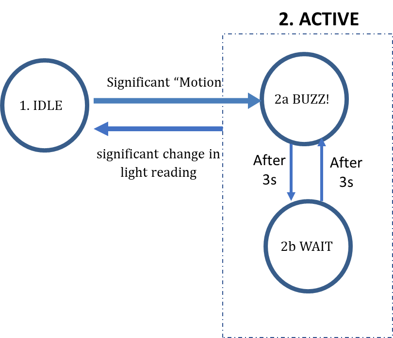

  

# Wireless Networking aka "Wireless for IoT Class"
## Course code: CS4222/CS5422  
### Semester 2, 2022/2023
### Instructor: Professor Ambuj Varshney
### Contact: [ambujv@nus.edu.sg](mailto:ambujv@nus.edu.sg), COM3: #02-25     

----
****

# ASSIGNMENT 2 (Due, TBA)

## Assignment 2 (Due: TBA)

**Total Marks: 70 (7% weightage for CS4222/CS5422)**
 
This is an **INDIVIDUAL** assignment.   
**Important: We will check for code similarity and potential cases of plagiarism**
**Important: Please dont use ChatGPT to write code for this assignment **

### Overview

In this assignment, you will learn how to use sensors,  actuators and schedule events using timers in the Contiki OS. In addition, this assignment will familiarize you with using sensors and actuators. Essentially, you will sense different physical phenomena, conduct some processing, and correspondingly activate actuators.

### Timers

Executions in Contiki is event-driven and use of timers are common. The Contiki system provides a set of timer libraries. In this assignment, you will look at using the etimer and rtimer. A timer uses the data structure struct timer. Three function calls are used to control a timer.

* timer_set()is used to initialize and starts the expiration time.
* timer_reset() is used to restart the timer from previous expire time.
* timer_restart() is used to restart the timer from current time.

One difference between etimer and rtimer is the time resolution. etimer’s clock resolution depends on the number of clock ticks per second (CLOCK_SECOND), while rtimer uses RTIMER_SECOND.

Another difference is that programming style. Etimer uses a more “sequential” model while rtimer uses callback.

Sample code for etimer:


PROCESS_THREAD(example_process, ev, data)
{
PROCESS_BEGIN();
etimer_set(&timer_etimer, CLOCK_SECOND); /* Delay 1 second
*/
while(1) {
PROCESS_WAIT_EVENT_UNTIL(etimer_expired(&timer_etimer));
etimer_reset(&timer_etimer);
}
PROCESS_END();
}


Sample code for rtimer:


PROCESS_THREAD(process_rtimer, ev, data)
{
PROCESS_BEGIN();
init_opt_reading();
while(1) {
rtimer_set(&timer_rtimer, RTIMER_NOW() + RTIMER_SECOND, 0,
do_rtimer_timeout, NULL);
PROCESS_YIELD();
}
PROCESS_END();
}


You can read more about timers on the [following link](https://docs.contiki-ng.org/en/develop/doc/programming/Timers.html).

### Sample Programs

We are providing you three sample programs that can provide you with hints to conduct this assignment.

* etimer-buzzer.c: a sample program that shows how to use the etimer and the buzzer
* rtimer-lightSensor.c: a sample program that shows how to read from the light sensor
* rtimer-IMUSensor.c: a sample program that shows how to read from the IMU sensor

Run the C programs and observe the output generated by the printf statements. Your Makefile
should include names of all the new programs.


CONTIKI_PROJECT = etimer-buzzer rtimer-lightSensor rtimer-IMUSensor


### Assignment

### TASKS:  Clock Resolution

From the output of etimer-buzzer.c, note down the value of CLOCK_SECOND. Find out how many clock ticks corresponds to 1s in real time.
From the output of rtimer-lightSensor.c. note down the value of RTIMER_SECOND. Find out how many clock ticks corresponds to 1s in real time.

### TASKS: Implementing States

Write the program to implement the state transition diagram given below.

  

The program starts in the IDLE mode. On detecting “significant motion”, it moves into the ACTIVE mode. There are two states in the ACTIVE mode,  BUZZ! and WAIT. In the BUZZ! state, the sensorTag uses the buzzer to generate a sound. In the WAIT state, the sensorTag does not
generate any sound. When entering the ACTIVE mode from the IDLE mode, the system goes into the BUZZ! state and generate the sound for 3 seconds. After 3 seconds, it goes into the WAIT state (buzzer off) and remains in the WAIT state for 3 seconds before going back to the BUZZ! state. Thus, state transitioning from BUZZ! to WAIT or vice versa occurs every 3 seconds. While in the ACTIVE mode (system can be in either BUZZ! or WAIT state), the system moves to the IDLE state when it detects a significant change in light reading.

* You need to sample the appropriate sensor (IMU sensor in the IDLE mode and light sensor in the
ACTIVE mode) to detect changes.
* Significant change of light reading is defined by a change of more than 300 lux in the light
intensity.
* Do not sample the light sensor at a rate higher than 4 Hertz as the driver does not work well at
higher sampling rate.
* Significant motion is defined as picking up or moving of your arm while holding the sensorTag in
your hand. You need to determine how to detect significant motion using the IMU sensors.
* Do not sample the IMU sensor at a sampling rate higher than 50 Hertz as higher sampling rate
may result in unstable behaviour.

If you are unable to complete the demonstration during the tutorials, you can email the Lecturer, or one of the TAs for an appointment. 
 
Grading/demonstrate should be completed by XXXX.  
 
Late penalty is 10% per day after XXXX.

