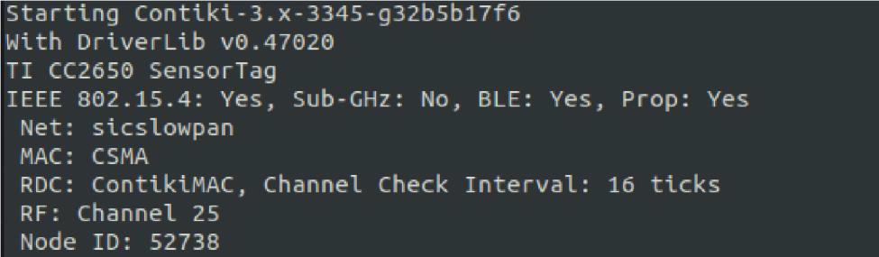

  

# Wireless Networking aka "Wireless for IoT Class"
## Course code: CS4222/CS5422  
### Semester 2, 2022/2023
### Instructor: Professor Ambuj Varshney
### Contact: [ambujv@nus.edu.sg](mailto:ambujv@nus.edu.sg), COM3: #02-25     

----
****

# ASSIGNMENT 3(a) (Due, 31st of March 2023)
 
This is a **GROUP** assignment.

You can conduct this experiment in a group of 2-4 group. It should be completed with each project group.

Assignment weightage towards final grade: 13% of Course Grade   

**Important: We will check for code similarity and potential cases of plagiarism**  
**Important: Please do not use ChatGPT to write code for this assignment. We will particularly check for ChatGPT plagiarism.**

### Overview

In this assignment, you will learn about the concept of RSSI (Received Signal Strength Indicator) and how it relates to wireless communication. You will conduct experiments to observe (1) how RSSI varies with the distance between the sender and the receiver, (2) how RSSI is affected by obstacles that block the line-of-sight between the sender and the receiver, and (3) how accurate RSSI is as a measure of the distance between the sender and the receiver.

### Configuration and Setting for Link Measurement

  

To use the programs you are given for this assignment, you need to specific the hardware address (Node ID) in the transmit_assignment3.c program. 

Pick a node to be the receiver. When the node starts and prints out its device and configuration information to the (USB) serial port, you can see its unique “Node ID” as below:

In the example shown, the Node ID is 52738 (in decimal) or 0xCE02 (in hexadecimal). Enter this hex number in addr.u8 (e.g., addr.u8[0] = 0xCE, addr.u8[1] = 0x02). The Sender node is going to send packets to this Receiver using this “Node ID.  The receiver node captures these unicasted packets and prints out the delivered message and RSSI.

In the transmit_assignment3.c code, make sure you have a counter/identifier in the message sent. On the receiver side, use this counter/identifier to keep track of how many packets have been received successfully.

Set timer to send 4 packets every second for at least 10 seconds.

Put the programs in $CONTIKI_ROOT/examples/rime and add “receive” and “transmit” in Makefile in the directory.

### Sample Programs

* [transmit_assignment3.c](https://ambuj.se/transmit_assignment3.c)
* [receive_assignment3.c](https://ambuj.se/receive_assignment3.c)

### TASKS:  RSSI vs Distance

  

Put the receiver and the sender at line-of-sight (no obstacle) and observe how RSSI and packet reception ratio changes (# of packet received in 10 sec. / # of transmitted in 10 sec.) when you change the distance between them from 1m to 30m. Report your results using two graphs similar to the graphs shown below (RSSI vs distance and loss ratio vs distance).

Repeat the experiments in other environments and different placement of receiver but keeping line-of-sight and no obstacle between transmitter and receiver. Discuss your measurements in your report.

  

### TASKS: RSSI with Obstacles

Let’s see how different obstacles between the sender and the receiver affect RSSI & packet loss ratio. Let’s measure RSSI at the same distance (use a distance of between 1m to 5m). You should keep the distance the same but you need to specify the distance used in the measurements.
Try out different type of obstacles between sender and receiver (at least 5 types). Discuss your measurements in your report.

| Obstacles (some examples)|  RSSI | 
|-------|--------|
| Door|  | 
| Wall | | 
| Thick Wall | | 

### TASKS: Discussion

1. Are there any other factors that can affect RSSI other than distance and obstacles? Design new experiments and analyse the test results as needed.
1. How good is RSSI as proxy for distance? Justify your answer based on experimental results.

### Evaluation

**Submission instructions:** Submit a single zip file (“Assignment3a - YourGroupNumber.zip”) to folder “Assignment3 Submission” on Canvas by the due date. If you submit multiple times, only the latest submission will be evaluated. Your submission should include the following:

1. Code used in your measurements.
1. A report in PDF format that contains the answers to above task questions

Late penalty is 10% per day after 31st March 2023.

