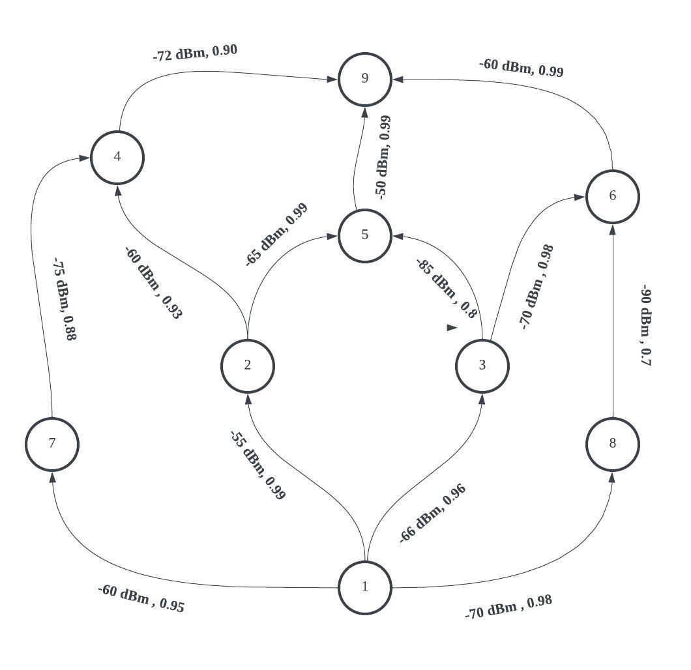

  

# Wireless Networking aka "Wireless for IoT Class"
## Course code: CS4222/CS5422  
### Semester 2, 2022/2023
### Instructor: Professor Ambuj Varshney
### Contact: [ambujv@nus.edu.sg](mailto:ambujv@nus.edu.sg), COM3: #02-25     

----
****

# TUTORIAL 10 (Optional) for WEEK 14 (Starting 10th April 2023)
## This is a non-graded tutorial. In this tutorial session, we provide some sample questions to help you prepare for final examination.

[1] **Question 1:**  You have been provided with an IoT device that utilizes active radio and highly energy-efficient wake-up receivers. These receivers facilitate low-power idle mode and channel sensing. Ordinarily, the nodes remain in sleep mode  for the majority of the time, briefly waking up (for 1 data packet duration) to use the wake-up receiver for looking/sensing for active transmission. If a transmission is detected, they transition into reception mode. The transmitter employs a mechanism akin to X-Mac and Contiki MAC, repeatedly sending data packets rather than transmitting an explicit preamble message. Given the table outlining power consumption, please perform the following calculations:

| Mode |Transmit Current (mA) @ 3 Volts |
|-------|--------|--------|
| Sleep | 0.01|
| Active (Transmission)| 10 |
| Active (Reception)| 10 |
| Channel Sensing| 0.1|

The device employes radio transceiever with PHY supporting 250 kilobits/second bitrate. The size of a data packet (with all fields included)
is 127 bytes. The device performs channel sensing every 100 milliseconds.

**Please note:** We define one radio cycle as period between two channel sensing events, i.e., one radio cycle is 100 milliseconds long.

* What is the transmission time for data packet? (1 point)
* What is the maximum number of data packets would the transmitter need to send? (1 point)
* What is average power consumption of one radio cycle when no transmission is occurring? and when there is a data transmission? (3 point)

[2] **Question 2:**  You are given an IoT network deployment that has topology similar to shown. The edge of the graph indicates the link quality for the link in form of average received signal strength, and packet reception ratio. Based on this graph, please answer the following questions.

* What is the best route if you only have to maximize and select the best quality link?
* What is ETX of various links in the topology?
* What are the ETX for various links in the graph?
* What is the best path considering minimum hops to the destination?

