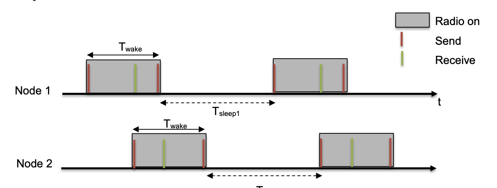
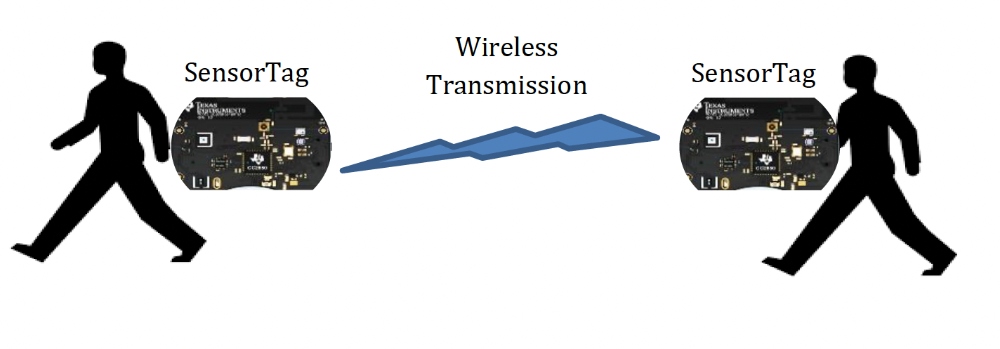
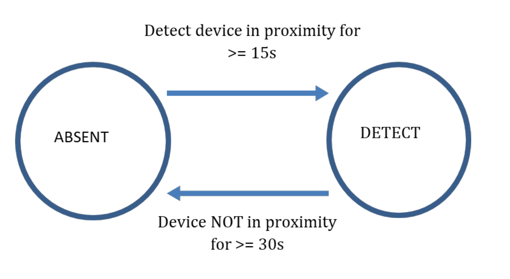

  

# Wireless Networking aka "Wireless for IoT Class"
## Course code: CS4222/CS5422  
### Semester 2, 2022/2023
### Instructor: Professor Ambuj Varshney
### Contact: [ambujv@nus.edu.sg](mailto:ambujv@nus.edu.sg), COM3: #02-25     

----
****

# Project (Due, 21st April 2023)

This is a **GROUP** assignment.

You can conduct this experiment in a group of 2-4 group. It should be completed with each project group.

**Important: We will check for code similarity and potential cases of plagiarism**  
**Important: Please do not use ChatGPT to write code for this assignment, in-particular for ChatGPT plagiarism.**

### Overview

In this project, you will integrate and apply various concepts acquired throughout the course, such as sensor interfacing, proximity detection using received signal strength, neighbor discovery, programming contiki operating system and delay-tolerant networking. You will develop a comprehensive project encompassing all these elements.

The project is structured into two  parts. In the first part, you will implement a neighbor discovery mechanism based on the "birthday protocol." Subsequently, in the second part of the project, you will enhance this neighbor discovery mechanism to establish a delay-tolerant sensing application. The following sections provide a detailed description of these components.

### Neighbour Discovery

You have been given a program that implements a fundamental "birthday protocol." In this protocol, each node wakes up at random intervals to transmit data and listen for transmissions from nearby devices. The following illustration demonstrates the steps involved in the protocol's operations.

  

The identical code is executed on all nodes. Each node wakes up for a duration of **Twake**, during which it sends two packets: one at the beginning of the wake-up period and another at the end, just before returning to sleep. Following the initial transmission, the node keeps its radio on to listen for potential incoming messages.

In the illustration above, Node 1 and Node 2 operate based on their individual timers. The intervals between two consecutive wake-up slots (**Tsleep1**and **Tsleep2** in the figure) are randomly selected from a uniform distribution, sharing the same mean **Tsleep** value.

Adjusting **Twake** and **Tsleep** will influence the latency experienced by nodes when discovering neighboring devices and the radio energy consumption. The radio's duty cycle can be calculated using the formula: **Twake / (Twake + Tsleep)**

You are provided with a C program, "nbr.c," which implements the fundamental logic outlined above. The modifiable parameters in the program are as follows:

WAKE_TIME (Twake): The default value is set to (RTIMER_SECOND / 10) or 100ms.

The maximum duration of a single sleep interval is constrained by the RTIMER count wraparound. Therefore, the total sleep interval between two wake-up periods is calculated as the product of the duration of a single sleep (SLEEP_SLOT) and the number of sleep cycles (SLEEP_CYCLE).

* SLEEP_SLOT: The default value is the same as WAKE_TIME.
* SLEEP_CYCLE: This represents the average number of sleep cycles, with a default value of 9.
The duty cycle is calculated using the formula: WAKE_TIME / (WAKE_TIME + SLEEP_CYCLE * SLEEP_SLOT).

### Setting up Contiki

1. Create a folder named "nbr_discovery" in the contiki-ng/examples directory
1. Copy nbr.c and Makefile in the above created folder
1. Compile the nbr program using command “make TARGET=srf06-cc26xx BOARD=sensortag/cc2650 CPU_FAMILY=cc26xx” in the directory “contiki-ng/examples/nbr_discovery”.
1. Use uniflash program to burn the binary file to the SensorTag.
1. Observe the output of the program through the USB serial port.

You need to run the program on at least 2 devices to perform the experiment. Consider two devices A and B.

### TASK 1

1. Using the default settings, observe and record how long the devices take to discover each other. Pick one of the devices as A and plot the cumulative distribution of the intervals between packet receptions on device A hearing from device B.
1. Reset device B and observe how long it takes for device A to hear from device B after device B reboots. You may need to modify the given code to observe this duration. Perform the experiments at least 10 times and plot the cumulative distribution.
1. Try out different settings and discuss your observations.

Next, please modify the program (nbr.c) so that two-way discovery (A hears from B AND B hears from A) can be completed in a deterministic manner within 10 seconds. You should choose settings so that the radio power consumption is “minimized”. 

You must include the following in the report (details instruction below in the document): a) the algorithm you have implemented b) the parameters chosen c) the maximum two-way latency observed - the radio duty cycle achieved

### Delay-tolerant Sensing and Communication

Delay-tolerant networks (DTNs) can handle long or variable delays, limited or intermittent connectivity, and often have limited bandwidth. They are useful in situations where there is no direct end-to-end communication path, such as in remote sensor networks or disaster scenarios. Apple's AirTag and Find-my network is an example of a DTN, where nearby Apple devices act as relays to track the AirTag's location using Bluetooth and ultra-wideband technology. This allows AirTag to be located even when out of range of its paired device. 

In this project, you will design a  basic implementation of such a network. One node would be sensing light readings. Next, one or more sensor tags would discover this light sensing nodes is nearby, and then receieve the accumalated light sensor readings. We describe these task in much greater detail next.

  

### TASK 2

Assign one of the SensorTag the task of sampling the light sensors. These light readings should be collected at an interval greater than 30 seconds. Please store last 10 collected light sensor readings in an array. You can refer to the code in the Second assignment on how to sample light sensors. 

In the next step, the other sensortag should discover sensor tag with light sensor, and should transfer the collected light sensor readings. However, this transfer process should only start when the sensor tags are "in-proximity". You can think of proximity as a distance within 3m. More specifically, the transfer should only start when the sensor tags have been in proximity for at-least 15 seconds. Furthermore, the sensor tag should also detect  the condition that the sensor tag has moved away (> 3 meters) for 30 seconds or more.

  

More specifically, you have to perform the following tasks:

1. Choose one SensorTag to be responsible for sampling the light sensors.
1. Use the code from the Second assignment to sample the light sensors. Set the sampling interval to be greater than 30 seconds.
1. Store the last 10 collected light sensor readings in an array.
1. In order for the other SensorTags to discover the SensorTag with the light sensor, you can use code written for Task 1. Please also have the additional constraint (Detect that devices are in contact for 15 seconds or more, and secondly discover that a node in proximity has moved away for 30s or more with high probability)
1. Once a SensorTag detects that it is in close proximity to the SensorTag with the light sensor (within 3 meters) for a time period > 15 seconds, it has to start the transfer process for light readings.
1. The SensorTag with the light sensor should respond by sending the requested array to the requesting SensorTag.

Your code should output (write to stdout using printf) the time a device first detects another device in the following format:

Timestamp (in seconds) DETECT nodeID

DETECT is a keyword for detection of a NEW node. The fields are separated by a single whitespace. For example:

* 123 DETECT 34567
means that at the 123 seconds, node with ID 34567 is detected and at time 138 (123 + 15) seconds, the device 34567 is still in proximity.

When a node is determined to have moved away, print the information using the following format:

* 345 ABSENT 34567

Therefore, at the 345 seconds, node with ID 34567 moves away and until 375 (345 + 30) seconds, the device 34567 is still NOT in proximity.
  
Notes:

- The timestamp is a time when another node starts moving near (within ~3m) or starts moving away.
- DETECT is only printed when another node stays close for at least 15 seconds
- ABSENT is only printed when another node has moved away at least 30 seconds
- Please keep the energy consumption for performing the neighbour discovery and other task as low as possible

Finally, after the node has been successfully detected, also print the light sensor readings that were transferred. Please print them as follows:

"Light: Reading 1, Reading 2, .... , Reading 10"

### PROGRAM

We provide implementation of basic neighbour discovery program here: [nbr.c](https://ambuj.se/nbr.c)

### Hardware

You would need atleast two nodes for this assignment. Please pick one as a light-sensor and another as a receiver (data mule).

### Evaluation

We will evaluate your system using different scenarios based on metric such as those listed below:

* Detection accuracy. Accuracy includes detection of new node moving near, existing node moving away, and the times it take to detect these events.
* Robustness. A node should be able to perform well with obstacle and potential collision (existence of additional node(s))
* Steps taken to reduce energy consumption
* Logic for tranferring light sensor readings
* Creativity of solution

**Submission instructions:**  Submit a single zip file named group-number-project.zip to CANVAS with following files:

1. A single pdf file (report.pdf)

* The neighbor discovery protocol you have implemented to “duty-cycle” your radio in order to reduce power consumption. 

* The logic that you have implemented for proximity detection

* Results showing evaluation of your system

* Logic to sense light readings and transfer to another sensor tag

2. Your code in a single directory named source-code

* Your code must be able to compile to run SensorTag 
* A README file to compile and execute your program(s).

Late penalty is 10% of marks after 21st April 2023 (Submission would not be accepted after 28th of April 2023).

