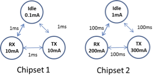

  

# Wireless Networking aka "Wireless for IoT Class"
## Course code: CS4222/CS5422  
### Semester 2, 2022/2023
### Instructor: Professor Ambuj Varshney
### Contact: [ambujv@nus.edu.sg](mailto:ambujv@nus.edu.sg), COM3: #02-25     

----
****

# TUTORIAL 4 (Starting 6th of February 2023)

[1] **Question 1:** What is the typical battery capacity of common devices that you use in your daily life such as wearables (Apple Watch/Fitbit), earphones, laptops, and mobile phones?

[2] **Question 2:**
* In the figure represting state transition diagtam, which chipset is more suitable for used in Internet of Things applications? Explain your reasoning.

* For the chipset chosen in the question above, assume that the devices are designed to operate at a very low duty-cycle (<0.01%) and you are allowed to reduce the current drawn from only one of the states (idle, receive (RX) or transmit (TX)). Which state would you reduce the current from?    

  

[3] **Question 3:**  Please find specification of following technologies:

| Specification | Bluetooth| ZigBee | WiFi | [LoRea (Backscatter)](https://www.diva-portal.org/smash/get/diva2:1163386/FULLTEXT01.pdf) | [Judo (Backscatter Like)](https://www.diva-portal.org/smash/get/diva2:1713259/FULLTEXT02) | 
|-------|--------|---------|---------|---------|
| VDD(V) | 1.8 | 3.0 | 3.3 | 2| 0.1|
| Transmit (mA)| 60 | 30 |220| 0.035| 0.7 |
| Receive (mA)| 50 | 25 | 210| N.A | N.A|
| Bitrate (Mb/s)| 1.2| 0.25 | 54| 0.03| 0.1|

