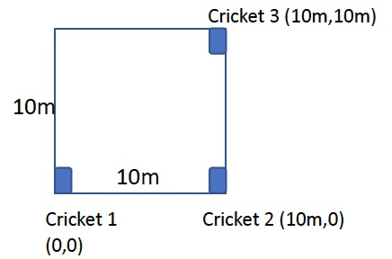
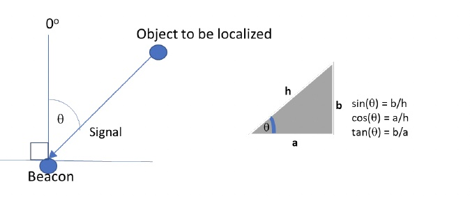

  

# Wireless Networking aka "Wireless for IoT Class"
## Course code: CS4222/CS5422  
### Semester 2, 2022/2023
### Instructor: Professor Ambuj Varshney
### Contact: [ambujv@nus.edu.sg](mailto:ambujv@nus.edu.sg), COM3: #02-25     

----
****

# TUTORIAL 5 for WEEK 8 (Starting 6th March 2023)

[1] **Question 1:** The figure below shows a 2D square of 10m by 10m with three cricket nodes placed at different locations. The table below shows the wall clock time for the radio and audio signals from the node to be localized to reach each of the three cricket nodes. You can assume that the speed of light is 2x10^8 m/s and the speed of sound is 300m/s. You can also ignore the processing time. Your task is to estimate the (x,y) coordinates of the node to be localized in meters, using cricket 1 as the origin (0,0). 

  

| |Cricker 1 | Cricket 2| Cricket 3| 
|-------|--------|---------|---------|
| Radio |1s |1s|1s|
| Radio |1.028s | 1.020s| 1.020s|

[2] **Question 2:** Localization can also be done by measuring the angle of (signal) arrival. In the left figure below, the signal angle of arrival is theta degree. The right figure below provides reference for some basic trigonometric relationships.

  

Consider a 2-D plane with two beacons. Beacon 1 is located at (0,0) and beacon 2 at (10,0). Let the (unknown) position of the object to be localized be (X,Y). The angle of signal arrival from the object to Beacon 1 is 40 degree and the signal angle of arrival from object to Beacon 2 is 300 degree. Write down 2 equations that determines the unknown location (X,Y) and find the values of X and Y.

