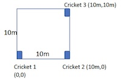

  

# Wireless Networking aka "Wireless for IoT Class"
## Course code: CS4222/CS5422  
### Semester 2, 2022/2023
### Instructor: Professor Ambuj Varshney
### Contact: [ambujv@nus.edu.sg](mailto:ambujv@nus.edu.sg), COM3: #02-25     

----
****

# TUTORIAL 5 for WEEK 8 (Starting 6th March 2023)

[1] **Question 1:** In the figure below, 3 cricket nodes are placed in a 2D square of 10m by 10m.  The wall clock time for the radio and audio signals, emitted by the node to be localized, to reach the 3 cricket nodes are shown in the table below.  You can assume that speed of light is 2x10^8 m/s and speed of sound is 300m/s. Also processing time is negligible. Your task is to estimate the location of the node to be localized giving the (x,y) coordinates in meters, using the position of cricket 1 as (0,0).

  

| |Cricker 1 | Cricket 2| Cricket 3| 
|-------|--------|---------|---------|
| Radio |1s |1s|1s|
| Radio |1.028s | 1.020s| 1.020s|

