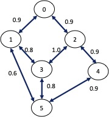

  

# Wireless Networking aka "Wireless for IoT Class"
## Course code: CS4222/CS5422  
### Semester 2, 2022/2023
### Instructor: Professor Ambuj Varshney
### Contact: [ambujv@nus.edu.sg](mailto:ambujv@nus.edu.sg), COM3: #02-25     

----
****

# TUTORIAL 7 for WEEK 11 (Starting 20th March 2023)

[1] **Question 1:**  A node running BMAC spends its time in the following 4 states (1) sleeping (consumes 1mW), (2) idle listening (consumes 10mW) (3) receiving (consumes 20mW) and (4) transmission (consumes 20mW). Note that in the idle listening state, a node detects channel activity but does not receive data. In the receiving state, there is actual packet reception. By default, it wakes up every 250ms to sample the channel for a duration of 5ms. Every 5s, the node transmit or receive a packet with equal probability. Packet transmission or reception duration is always 5ms. On the average, what is the percentage of the energy spent on: 

* sleeping,
* idle listening, 
* receiving 
* transmission? 
* If the battery used provides 10KJ of energy, what is the lifetime of the node?

[2] **Question 2:** The per-hop packet error rate on a path with four hops are 0.25, 0.1, 0.5, and 0.2. What is the (a) path ETX and (b) the probability that a packet can traverse the path with no error/retransmission?

[3] **Question 3:** In the figure below, nodes indicate IoT devices and two devices can communicate if there is a link between them. The number associated with each link is the link quality measured in expected packet delivery ratio.

For the figure, find the shortest path from node 5 to node 0 using two different routing metric:

* Hop count
* Expected number of transmission (ETX). Show your working.
* Let the minimum useable link quality be set to 0.6. If the shortest hop count path is X, how long (in hop) can the path chosen by ETX be in terms of X? 

  

[4] **Question 4:** What are (1) wireless mesh network, (2) mobile ad hoc network and (3) delay/disruption tolerant network? What are the differences in the design of the respective routing protocols for each of these 3 different type of networks?

[5] **Question 5:** TBA

