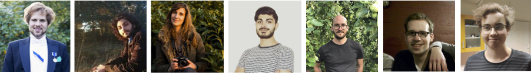

## Previous students

  

Previous Students:

1. [Yusril Izza (2023)]() [Masters program, National University of Singapore]
  * Project/Thesis Title: Data Storage on IoT Devices 
1. [Goh Sheen An (2023)]() [Masters program, National University of Singapore]
  * Project/Thesis Title: Integration of Embedded Wireless Microphones with Open AI Whisper System  
1. [Lim Soon Lee (2023)]()  [Masters program, National University of Singapore]  
  * Project/Thesis Title: Fabricating Sticker Form-Factor Sensors
1. [Qiao Yukai (2022 - 2023)]()  [Masters program, National University of Singapore]  →  State Grid Corporation of China
  * Project/Thesis Title: Collecting, Analyzing and Visualising Data from Battery-free Internet of Things
1. [David Håkansson]() (2022, Bachelors program, Uppsala University) 
  * Project/Thesis Title: [Controlling Latency for Batteryless Sensors through Environment Control](https://uu.diva-portal.org/smash/get/diva2:1705040/FULLTEXT01.pdf)  
1. [Andreas Soleiman (2016-2019)](http://ansol.se) [Research Assistant and Bachelors+Masters Program] → MIT EECS PhD (withdrew to stay in industry) → Senior Data Scientist, H&M Group, Stockholm, Sweden
  * Project/Thesis Title: [Battery-free Visible Light Sensing](http://uu.diva-portal.org/smash/get/diva2:1303148/FULLTEXT01.pdf)
1. [Gustav Eriksson/Fredholm (2018)]()[Masters program]  → Teamleader Intertek Semko, Stockholm
  * Project/Thesis Title: [Towards Long-Range Backscatter Communication with Tunnel Diode Reflection Amplifiers](http://www.diva-portal.org/smash/get/diva2:1223106/FULLTEXT01.pdf) 
1. [Oliver Harms (2016-2017)](https://www.chalmers.se/en/staff/Pages/harms.aspx)[Master program] → Chalmers PhD, Sweden
  * Project/Thesis Title: [Modulation Schemes in Ambient Backscatter Communication](http://www.diva-portal.org/smash/record.jsf?pid=diva2%3A1275419&dswid=-4978)
1. [Sam Hylamia (2017-2018)](https://katalog.uu.se/profile/?id=N15-1362)[Masters program and Research Assistant] → Uppsala University PhD
  * Project/Thesis Title: [Towards Battery-free Radio Tomographic Imaging](http://www.diva-portal.org/smash/get/diva2:1247160/FULLTEXT02.pdf)
1. [Elena di Lascio (2015-2016)](https://www.inf.usi.ch/phd/dilascio/) [Masters program] → USI PhD (completed) → Novartis Institutes for BioMedical Research (NIBR), Switzerland
  * Project/Thesis Title: [A Battery-free Indoor Localization System]()
1.  [Simon Olofsson (2015)](https://www.doc.ic.ac.uk/~so2015/)[Research assistant] → Imperial College London PhD → Facebook/Meta, London, UK
  * Project title: [Convergecast using Electronically Steerable Directional Antennas](https://dl.acm.org/doi/10.1145/3465219)

Visiting Students:

**Undergraduates:**

1. [Adithya Bijoy]()(From: CSE UG@Indian Institute of Technology, Delhi)(Visiting undergraduate student)
* Project Title: Oppurtunistic Network support for Backscatter Sensors
1. [Moteen Shah]()(From: EE UG@VJTI, Mumbai)(Visiting undergraduate student)
* Project Title: Software Defined Backscattering
1. [Madhav Manish Gulati]()(From: EE UG@Indian Institute of Technology, Delhi)(Visiting undergraduate student)
* Project Title: Oppurtunistic Network support for Backscatter Sensors
1. [Tejas Gupta]()(From: EE UG@Indian Institute of Technology, Kanpur)(Visiting undergraduate student)
* Project Title: LLM, Image Processing Support at Edge Devices
1. [Pouya Shamshiri]()(From: EE UG@Sharif University of Technology, Iran)(Visiting undergraduate student - 27/04/2023 - 30/06/2023)
* Project Title: Complex Computation on Embedded Devices
1. [Erfan Baghaei]()(From: EE UG@Sharif University of Technology, Iran)(Visiting undergraduate student - 27/04/2023 - 30/06/2023)
* Project Title: Complex Computation on Embedded Devices

**Graduate:**

1. [Muhammad Sarmad](https://networks.imdea.org/team/imdea-networks-team/people/muhammad-sarmad-shahab-mir/)(From: UC3M/IMDEA Networks, Spain)(Visiting doctoral student - 12/09/2022 - 03/10/2022)
  * Project/Thesis Title: TunnelLiFi: Hybrid Light and Radio Systems using Tunnel Diodes
1. [Wenqing Yan]()(From: Uppsala University, Sweden)(Visiting doctoral student - 01/04/2023 - 30/04/2023)
  * Project/Thesis Title: Tunnel Diodes for Sensing and Communication

Collaborated with the following students:

1. [Lorenzo Corneo (Uppsala University)](https://lorenzocorneo.github.io/) 
1. [Wenqing Yan (Uppsala University)](https://wenqingyan.github.io/)
1. [Ander Galisteo (UC3M/IMDEA Networks)](https://andergalisteo.com/) 
1. [Revathy Narayanan (Postdoc scholar, KTH, Sweden)](https://sites.google.com/view/revathy-narayanan/home)  
