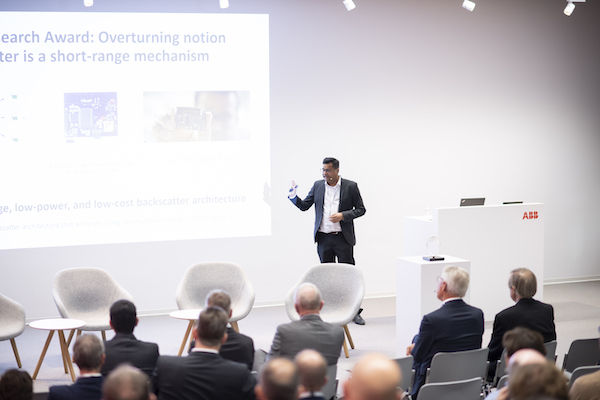
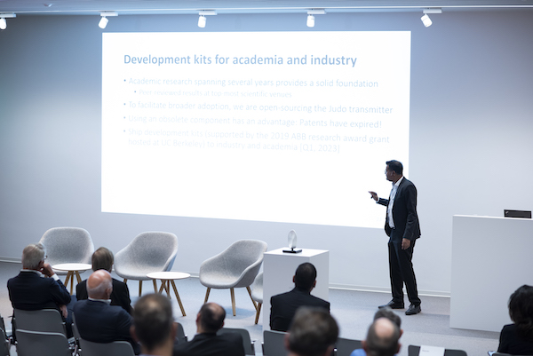
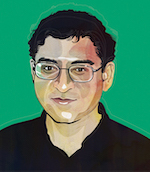

# STICORS: Framework for Large-Scale, Ubiquitous, Privacy-Preserving, Flexible Form-Factor, Everlasting Computers with a Very Long-Range Wireless Capability
  
We illustrate a proof-of-concept, flexible-form, wireless computer that can through reflection and absorption of ambient wireless signals (building on LoRea (ACM SENSYS 2017)) achieve significant transmission range.

## Project PI: Prof. Dr. Ambuj Varshney 

## Vision

The goal of this project is to develop a framework to manage large-scale deployments of flexible computers (STICORS) that are packed with sensors, processors, energy storage, and human-computer interaction mechanisms, and that can connect wirelessly over long distances. These computers will be able to handle a range of advanced computing and communication tasks. This framework has the potential to support a wide range of applications, but we are focusing on designing a platform for analytics on massive amounts of data collected (from physical world) using STICORS.

STICORS is a research project that requires expertise in multiple engineering fields, including electronics, communication, computer science, and materials science. At present, the goals of the STICORS project are not yet attainable and will require significant scientific advances, which are also the major focus of the STICORS project.

We are targetting following parameters for STICORS computers:

* **Bitrate:** Wireless communication link with bitrate of over 100 kbps (uplink and downlink)
* **Range:** Communication range of over 100 meters in a line-of-sight environment, but the range is limited to tens of meters in environments with obstructions (non line-of-sight)
* **Everlasting:** STICORS is designed for low power consumption through hardware and software optimizations, allowing the batteries to last for the entire deployment without replacement. In certain cases, STICORS may be able to function without batteries by utilizing energy harvested from ambient energy sources
* **Storage:** With support for hundreds of kilobytes of non-volatile memory, STICORS is able to store a vast amount of sensor and other information
* **Processing:** Ability to support complex computational and algorithmic tasks
* **Human Computer Interaction (HCI):** Interacting with users through novel low-power HCI mechanisms

## News

**[Q4, 2022]** Prof. Ambuj Varshney presented the vision of STICORS at ceremony of [2022 ABB Research Award in Honour of Hubertus von Grünberg](https://new.abb.com/news/detail/95853/abb-announces-2022-awardee-for-abb-research-award-in-honor-of-hubertus-von-grunberg), held at Baden, Switzerland. Guests in the attendance included the CEO of ABB - [Björn Rosengren](https://global.abb/group/en/about/corporate-governance/executive-committee/bjorn-rosengren), ex-chairman of ABB Hubertus von Grünberg, senior management of the company, and other dignitaries 

|| |

**[Q4, 2022]**  GRANT: STICORS received second grant at National University of Singapore from ARTIC for sensing using tunnel diodes

**[Q2, 2022]**  GRANT: STICORS received first grant at National University of Singapore from ODPRT (Startup Grant)

**[Q1, 2022]** Project Investigator (Prof. Ambuj Varshney) has joined as a faculty member at the School of Computing of the National University of Singapore.  

## Background

TBA

## Application Scenarios

We are targetting two application scenarios:

* [Industrial environments that enables the factories of the future]()
* 

## Collaborators

|| Professor. Prabal Dutta (Associate Professor, University of California, Berkeley)  Prabal Dutta is an Associate Professor of Electrical Engineering and Computer Sciences at the University of California at Berkeley, with a focus on mobile, wireless, embedded, networked, and sensing systems with applications to health, energy, and the environment. His work has been commercialized by several companies, has been utilized by thousands of researchers and practitioners worldwide, and has received several awards and nominations, including a Sloan Fellowship and a CAREER Award. He has served as chair or co-chair of several conferences and on the DARPA ISAT Study Group, and holds a Ph.D. in Computer Science from UC Berkeley. |

## Open-source Contributors

### Undergraduate Students

### Other Contributors

## Industry Contributors

## Advisory Board

TBD

## Students

TBA

## Policy for Intellectual Property

STICORS has the potential to significantly impact multiple fields and bring value to society. We are committed to openly publishing and releasing our software and hardware designs using a BSD-style license and will only seek intellectual property protection for our research results if it is necessary to ensure their impact. We prioritize continuous innovation and improvement over reliance on patents.

## Press Releases and News Coverage

* [Prestigious award for network researcher, ABB Review](https://new.abb.com/news/detail/62422/prestigious-award-for-network-researcher)
* [Press release from ABB regarding 2019 ABB Research Award in Honour of Hubertus von Grünberg](https://new.abb.com/news/detail/46277/abb-research-award-2019-goes-to-battery-free-sensor-project)
* [Press release from Uppsala University regarding 2019 ABB Research Award in Honour of Hubertus von Grünberg](https://www.uu.se/en/news/article/?id=13666&typ=artikel)
* [Press release from Uppsala University regarding most innovating project from the university](https://www.uuinnovation.uu.se/about/attractive-innovation-project-awards-2019/)

## Publications

STICORS is an ongoing research project at the National University of Singapore. Our sincere gratitude goes out to former advisors, collaborators and students of the PI at many of the world's foremost institutions for their contributions to this effort. In addition, they have contributed to peer-reviewed scientific publications that have appeared at several flagship scientific venues. We list these research efforts below:

### Overview

1. [Making Low-power and Long-range Wireless Backscatter Transmitters](https://dl.acm.org/doi/abs/10.1145/3551670.3551672)  
Author: *Ambuj Varshney*  
ACM GetMobile: Mobile Computing and Communications (Maker Edition) 2022  

### Human Computer Interaction

1. [Battery-free Visible Light Sensing](https://dl.acm.org/doi/abs/10.1145/3129881.3129890)  
Authors: *Ambuj Varshney*, Andreas Soleiman, Luca Mottola, Thiemo Voigt  
ACM VLCS (Co-located with ACM MobiCom) 2017  
**Best Paper Award**  
**ACM Student Research Competition Winner (Graduate, MobiCom)**  

### Sensing

1. [TunnelLiFi: Bringing LiFi to Commodity Devices]()  
Authors: Muhammad Sarmad Mir, Wenqing Yan, Prabal Dutta, Domenico Giustiniano, and *Ambuj Varshney*  
The Twenty-fourth International Workshop on Mobile Computing Systems and Applications (ACM HotMobile 2023)  

2. [POSTER: Enabling L3: Low Cost, Low Complexity and Low Power Radio Frequency Sensing using Tunnel Diodes]()
Authors: Wenqing Yan,  *Ambuj Varshney*  
The Twenty Eight Annual International Conference On Mobile Computing And Networking (ACM MobiCom 2022)  

3. [Demonstration: Towards Battery-free Radio Tomographic Imaging](https://dl.acm.org/doi/10.1145/3212480.3226107)  
Authors: Abdullah Hylamia,*Ambuj Varshney*, Andreas Soleiman, et al.    
The Eleventh ACM Conference on Security and Privacy in Wireless and Mobile Networks (ACM WiSec-2018)  
**Best demonstration award**

### Transmission

1. [Judo: Addressing the Energy Asymmetry of Wireless Embedded Systems through Tunnel Diode based Wireless Transmitters](https://dl.acm.org/doi/abs/10.1145/3498361.3538923)  
Authors: *Ambuj Varshney* , [Wenqing Yan](https://wenqingyan.github.io/), [Prabal Dutta](https://web.eecs.umich.edu/~prabal/)  
The Twentieth ACM International Conference on Mobile Systems, Applications, and Services (ACM MobiSys 2022)      

2. [TunnelEmitter:Tunnel Diode based Low-Power Carrier Emitters for Backscatter Tags](https://dl.acm.org/doi/10.1145/3372224.3419199)  
Authors: *Ambuj Varshney*, Lorenzo Corneo    
The Twenty Sixth Annual International Conference On Mobile Computing And Networking (ACM MobiCom 2020)  

3. [TunnelScatter: Low Power Communication for Sensor Tags using Tunnel Diodes](https://dl.acm.org/doi/10.1145/3300061.3345451)  
Authors: *Ambuj Varshney*, [Andreas Soleiman](http://ansol.se/academic), Thiemo Voigt  
The Twenty Fifth Annual International Conference On Mobile Computing And Networking (ACM MobiCom 2019)  

4. [LoRea: A Backscatter Architecture that Achieves a Long Communication Range](https://dl.acm.org/doi/10.1145/3131672.3131691)  
Authors: *Ambuj Varshney*, Oliver Harms, Carlos Penichet, Christian Rohner , Frederik Hermans, Thiemo Voigt  
Fifteenth ACM Conference on Embedded Networked Sensor Systems (ACM SENSYS 2017)  
**2019 ABB Research Award Winner**  

5. [Towards wide-area backscatter networks](https://dl.acm.org/doi/10.1145/3127882.3127888)  
Authors: *Ambuj Varshney*, Carlos Perez Penichet, Christian Rohner, Thiemo Voigt  
ACM HotWireless (Co-located with ACM MobiCom) 2017  

### Reception

1. [Two to Tango: Hybrid Light and Backscatter Networks for Next Billion Devices](https://dl.acm.org/doi/10.1145/3386901.3388918)   
Authors: Ambuj Varshney, [Ander Galiesto](https://andergalisteo.com/), Domenico Giustiniano    
The Eighteenth ACM International Conference on Mobile Systems, Applications, and Services (ACM MobiSys 2020) 

2. [Connecting Battery-free IoT Tags Using LED Bulbs](https://dl.acm.org/doi/10.1145/3286062.3286077)   
Authors: Domenico Giustiniano ,*Ambuj Varshney*, Thiemo Voigt    
The Eighteenth ACM Workshop on Hot Topics in Networks (ACM HotNets 2019)    

3. [Battery-free 802.15.4 Receiver](https://dl.acm.org/doi/10.1109/IPSN.2018.00045)    
Authors: Carlos Perez Penichet, Claro Noda,*Ambuj Varshney*, Thiemo Voigt  
The Seventeenth ACM/IEEE Conference on Information Processing in Sensor Networks.(ACM/IEEE IPSN 2018)    

### Processing 

### Security

### Energy 

----
## Funding
STICORS is generously supported (or have been previously supported) through grants from following agencies:  

* Sweden Innovation Agency (VINNOVA) hosted at Uppsala University, Sweden
* 2019 ABB Research Award in Honour of Hubertus von Grünberg hosted at University of California, Berkeley
* National University of Singapore (Startup grant)  

----
----
****
