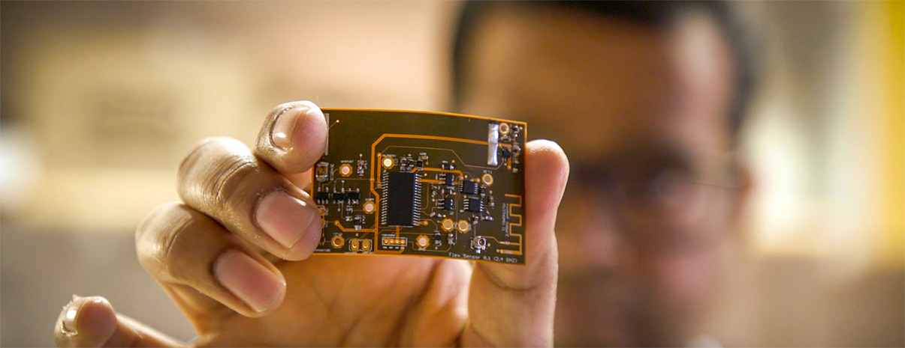

# STICORS: Framework for ubiquitous, privacy-preserving, long-range wireless, sticker-form, everlasting computers
  
We illustrate a proof-of-concept, sticker form factor, wireless sensor that can through reflection and absorption of ambient wireless signals achieve very significant transmission range

## Vision

TBD

## News

## Background

TBA

## Application Scenarios

TBA

## Advisory Board

TBD

## Students

TBA

## Policy for Intellectual Property

We are committed to open publication and open-source release of software and hardware designs using a BSD-style license. We will not seek IP protection for research results unless there is an overwhelmingly compelling case that IP protection is essential for the results to have an impact.

## Publications

STICORS is an ongoing research project at the National University of Singapore. Our sincere gratitude goes out to former collaborators and students of the PI (Ambuj Varshney) at many of the world's foremost institutions for their contributions to this effort. In addition, they have contributed to several peer-reviewed scientific publications that have appeared at several flagship scientific venues. We list these research efforts below:

### Sensing

1. [POSTER: Enabling L3: Low Cost, Low Complexity and Low Power Radio Frequency Sensing using Tunnel Diodes]()
Authors: Wenqing Yan,  *Ambuj Varshney*  
The Twenty Eight Annual International Conference On Mobile Computing And Networking (ACM MobiCom 2022)  

2. [Demonstration: Towards Battery-free Radio Tomographic Imaging](https://dl.acm.org/doi/10.1145/3212480.3226107)  
The Eleventh ACM Conference on Security and Privacy in Wireless and Mobile Networks (ACM WiSec-2018)  
**Best demonstration award**

3. [Battery-free Visible Light Sensing](https://dl.acm.org/doi/abs/10.1145/3129881.3129890)  
ACM VLCS (Co-located with ACM MobiCom) 2017  
**Best Paper Award**  
**ACM Student Research Competition Winner (Graduate, MobiCom)**  

### Transmission

1. [Judo: Addressing the Energy Asymmetry of Wireless Embedded Systems through Tunnel Diode based Wireless Transmitters](https://dl.acm.org/doi/abs/10.1145/3498361.3538923)  
The Twentieth ACM International Conference on Mobile Systems, Applications, and Services (ACM MobiSys 2022)      

2. [Making Low-power and Long-range Wireless Backscatter Transmitters](https://dl.acm.org/doi/abs/10.1145/3551670.3551672)  
Author: *Ambuj Varshney*  
ACM GetMobile: Mobile Computing and Communications (Maker Edition) 2022  

3. [TunnelEmitter:Tunnel Diode based Low-Power Carrier Emitters for Backscatter Tags](https://dl.acm.org/doi/10.1145/3372224.3419199)  
The Twenty Sixth Annual International Conference On Mobile Computing And Networking (ACM MobiCom 2020)  

4. [TunnelScatter: Low Power Communication for Sensor Tags using Tunnel Diodes](https://dl.acm.org/doi/10.1145/3300061.3345451)  
Authors: *Ambuj Varshney*, [Andreas Soleiman](http://ansol.se/academic), Thiemo Voigt  
The Twenty Fifth Annual International Conference On Mobile Computing And Networking (ACM MobiCom 2019)  

5. [LoRea: A Backscatter Architecture that Achieves a Long Communication Range](https://dl.acm.org/doi/10.1145/3131672.3131691)  
Fifteenth ACM Conference on Embedded Networked Sensor Systems (ACM SENSYS 2017)  
**2019 ABB Research Award Winner**  

6. [Towards wide-area backscatter networks](https://dl.acm.org/doi/10.1145/3127882.3127888)  
ACM HotWireless (Co-located with ACM MobiCom) 2017  

### Reception

1. [Two to Tango: Hybrid Light and Backscatter Networks for Next Billion Devices](https://dl.acm.org/doi/10.1145/3386901.3388918)   
The Eighteenth ACM International Conference on Mobile Systems, Applications, and Services (ACM MobiSys 2020) 

2. [Connecting Battery-free IoT Tags Using LED Bulbs](https://dl.acm.org/doi/10.1145/3286062.3286077)     
The Eighteenth ACM Workshop on Hot Topics in Networks (ACM HotNets 2019)    

3. [Battery-free 802.15.4 Receiver](https://dl.acm.org/doi/10.1109/IPSN.2018.00045)    
The Seventeenth ACM/IEEE Conference on Information Processing in Sensor Networks.(ACM/IEEE IPSN 2018)    

### Processing 

### Security

### Energy 

## Funding

We are generously supported through the following grants:

