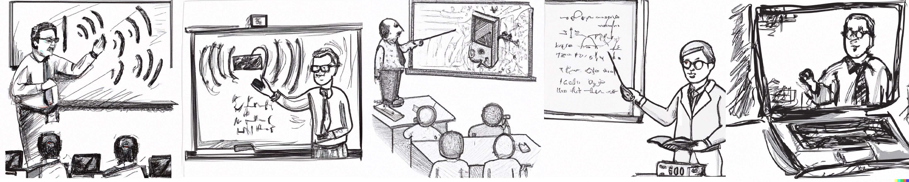

  

# Teaching  

## Fall Semester 2022 (National University of Singapore)

* [CS6204: Advanced Topics in Networking - Special Topics in Internet of Things](https://weiserlab.github.io/ambuj/cs6204)    
* CS6101: Mentoring/ Lab Rotation for newly joined PhD students    

## Spring Semester 2023 (National University of Singapore)

* [CS 4222/5422: Wireless Networking](https://weiserlab.github.io/ambuj/cs4222)    
